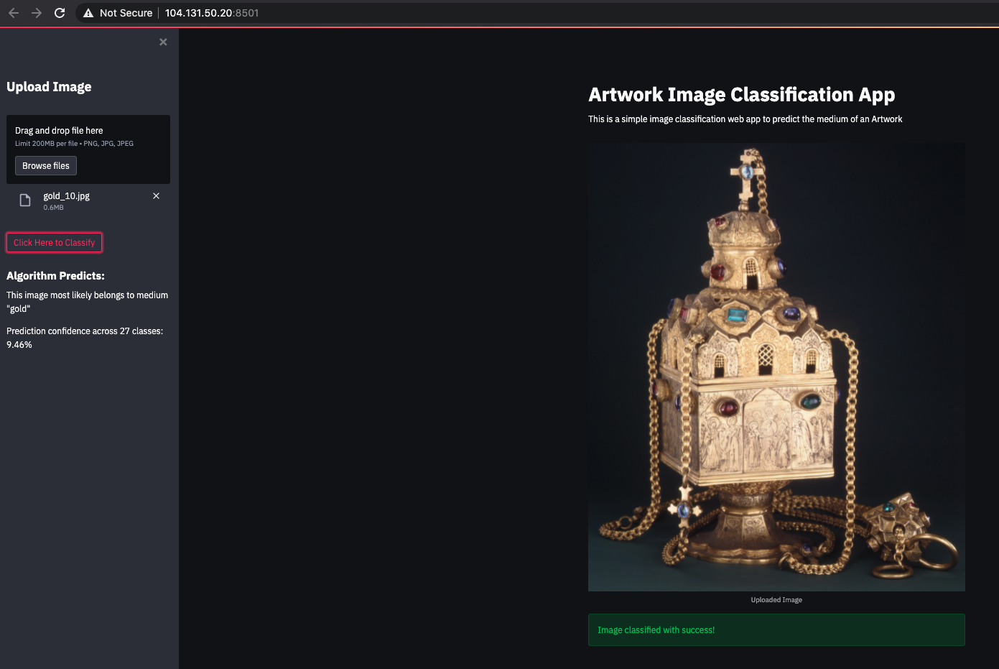
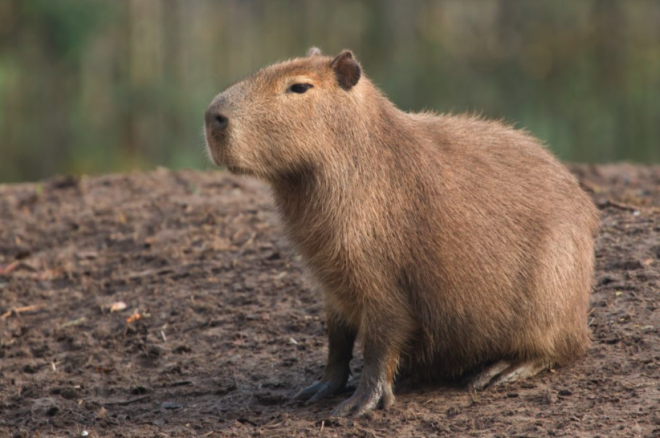

Capivara - Artwork Medium Image Classification
=====================================

*Capivara* is a Deep Learning model that given an artwork picture, 
returns the medium that the artwork was made. Written in Python. 

Endpoint
=====================================
URL: http://104.131.50.20:8501

Prediction screenshot
=====================================


Requirements
=====================================
Docker version 19+


Deploy
=====================================

```bash
bash start.sh
```

Acknowledgements
=====================================
This is part of my project related 
with the [Full Stack Deep Learning](https://fullstackdeeplearning.com/). Class Autumn/2021.


Why Capivara?
=====================================
Like my previous project [Urutu](https://github.com/fclesio/urutu-rent-home) 
(Search Homes in Berlin) I still just wanted to honor a typical Brazilian 
animal species. It has no special meaning. 

Capivara it's a nice animal, calm, gentle and lovely. 

According to Wikipedia "[The capybara (Hydrochoerus hydrochaeris) is a giant cavy rodent native to South America. It is the largest living rodent in the world"](https://en.wikipedia.org/wiki/Capybara)

